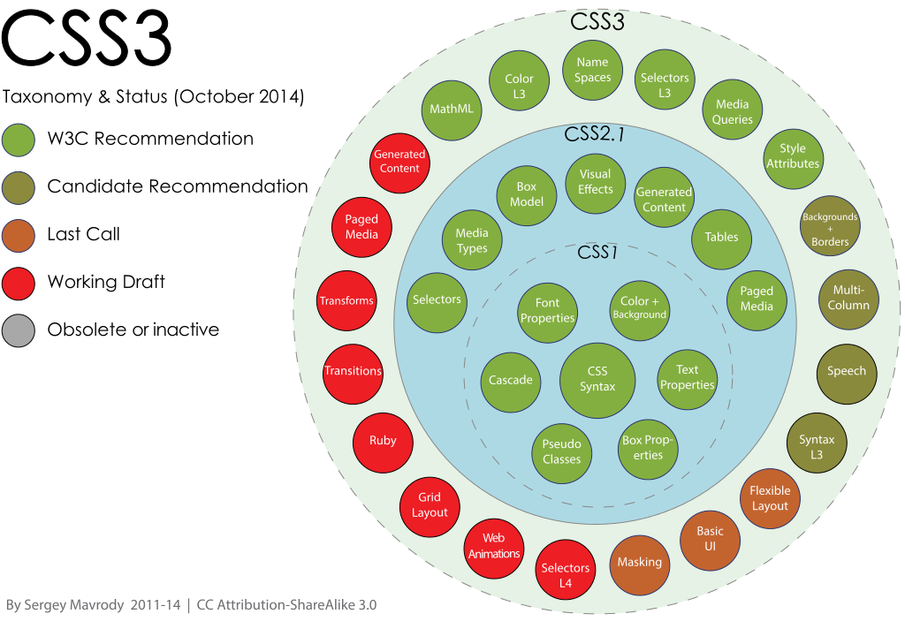

# 激动人心的 CSS3
[TOC]

由于过于庞大，`CSS3` 遵循模块开发，这将有助于理清模块化规范之间的关系。以下是 `CSS` 分类及其状态图详情请参阅 [wikipedia -- File:CSS3_taxonomy_and_status_by_Sergey_Mavrody.svg][1]：

##非 w3c 标准：

 1. CSS Reflections -- https://www.webkit.org/blog/182/css-reflections/
     - box-reflect -- `-webkit-box-reflect: <direction> <offset> <mask-box-image>`

##以下是 W3C 各模块相关规范：

 1. Selector (选择器) -- http://www.w3.org/TR/css3-selectors/
 2. CSS Flexible Box Layout Module Level 1 -- http://www.w3.org/TR/css-flexbox-1/
     - flex -- 指定了一个数字，代表了这个伸缩项目该占用的剩余空间比例
     - flex-grow -- 伸展系数
     - flex-shrink -- 收缩系数
     - flex-basis -- 定义了 Flex 项目在分配 Flex 容器剩余空间之前的一个默认尺寸
     - flex-direction: `row | row-reverse | column | column-reverse` -- 弹性布局，轴线方向
     - flex-wrap: `nowrap | wrap | wrap-reverse` -- 换行方式
     - flex-flow: `<flex-direction> || <flex-wrap>`
     - justify-content: `flex-start | flex-end | center | space-between | space-around` -- 主轴对齐
     - align-items: ` flex-start | flex-end | center | baseline | stretch` -- 侧轴子元素对齐
     - align-content: `flex-start | flex-end | center | space-between | space-around | stretch`  -- 伸缩行对齐方式
     - align-self -- 侧轴对齐，在flex子元素上设置
     - order -- 显示顺序
     - "margin:auto" -- 一个 "auto" 的 margin 会合并剩余的空间。它可以用来把伸缩项目挤到其他位置。
 3. CSS Image Values and Replaced Content Module Level 3 -- http://www.w3.org/TR/css3-images/
     - Gradients
     - object-fit 属性指定了替换元素(replaced elements)的内容应该如何使用他的宽度和高度来填充其容器.
     - object-position 属性指定了替换元素在容器中的对齐方式.
 4. CSS Color Module Level 3 -- http://www.w3.org/TR/css3-color/
     - RGB
     - RGBA
     - HSL
     - HSLA
     - opacity
     - currentColor -- currentColor 允许需要 <color> 的地方得到或者继承父元素的 color，因此，它其实就是作为一个inherit值，允许那些不能通过属性或子元素继承的颜色进行继承。这也意味着，对于已经继承了color值的属性，currentColor不会再被使用。元素中将会得到/继承元素color值的包括：
         - 元素的文本内容——正是color属性使用的地方
         - 文本的轮廓
         - 元素的边框
         - 元素的盒阴影
         - img的alt文本。也就是，当无法显示图像时，代替图像出现的文本，会继承这个颜色值。
         - 列表项的小黑点和边框
         - 一些浏览器（比如Chrome）水平线（`
`）的边框颜色。（没有边框的话，颜色就不会受影响）。
 5. CSS Backgrounds and Borders Module Level 3 -- http://www.w3.org/TR/css3-background/
     - border-radius
     - box-shadow：`inset x-offset y-offset blur-radius spread-radius color`
     - border-image
     - border-image-source
     - border-image-slice
     - border-image-width
     - border-image-repeat
     - background -- multiple background
     - background-size
     - background-clip: `border-box | padding-box | content-box`
     - background-origin: `border-box | padding-box | content-box` -- 设置背景图片显示原点
 6. CSS Text Decoration Module Level 3 -- http://www.w3.org/TR/css-text-decor-3
     - text-shadow：`X-Offset Y-Offset Blur Color`
 7. CSS Text Module Level 3 -- http://www.w3.org/TR/css-text-3/
     - word-wrap
     - word-break
     - white-space
 8. CSS Transforms Module Level 1 -- http://www.w3.org/TR/css-transforms-1/
     - Transform
     - transform-origin
     - transform-style：`flat|preserve-3d`
     - perspective：`none | <length>`
     - perspective-origin
     - backface-visibility -- 定义当元素不面向屏幕时是否可见。如果在旋转元素不希望看到其背面时，该属性很有用。
 9. CSS Transitions -- http://www.w3.org/TR/css3-transitions/
     - transition: `<property> <duration> <animation type> <delay>`
     - transition-property -- 作用的属性
     - transition-duration -- 持续时间
     - transition-timing-function
     - transition-delay -- 延迟
 10. CSS Animations -- http://www.w3.org/TR/css3-animations/
     - animation
     - animation-name
     - animation-duration
     - animation-timing-function
     - animation-delay
     - animation-iteration-count
     - animation-direction
     - animation-play-state
 11. CSS Basic User Interface Module Level 3 (CSS3 UI) -- http://www.w3.org/TR/css3-ui/
     - text-overflow
     - box-sizing: `content-box | padding-box | border-box`
 12. CSS Fonts Module Level 3 -- http://www.w3.org/TR/css-fonts-3/
     - @font-face: download font url
         - http://www.google.com/webfonts
         - http://www.dafont.com/
         - http://www.fontsquirrel.com/tools/webfont-generator -- 字体转换工具
         - http://www.youziku.com/ -- 有字库 中文字体转换 @font-face
 13. CSS Multi-column Layout Module -- http://www.w3.org/TR/css3-multicol/
     - column-count
     - column-width
     - column-gap: 列间隔
     - column-rule: 列分隔线样式，不占用空间
     - column-rule-color
     - column-rule-style
     - column-rule-width
     - column-span: 跨列显示
 14. Media Queries -- http://www.w3.org/TR/css3-mediaqueries/
 15. Filter Effects Module Level 1 -- http://www.w3.org/TR/filter-effects-1/
     - filter：`none | <filter-function-list>`
         - grayscale 灰度
         - sepia 褐色
         - saturate 饱和度
         - hue-rotate 色相旋转
         - invert 反色
         - opacity 透明度
         - brightness 亮度
         - contrast 对比度
         - blur 模糊
         - drop-shadow 阴影
     - filter():  `filter([ <image> | <string> ], <filter-function-list>)`
 16. Filter Effects Module Level 2 -- https://drafts.fxtf.org/filters-2/
     - backdrop-filter: `none | <filter-function-list>`, 与 filter 属性类似，但是 filter 属性会直接影响其后代所有元素，而 backdrop-filter 只针对元素背景做特效。
 17. CSS Values and Units Module Level 3 -- http://www.w3.org/TR/css3-values/
     - calc() -- calculate(计算)
     - vh -- (viewport height)/100
     - vw -- (viewport width)/100
     - vmin -- ((viewport height) > (viewport width) ? (viewport width) : (viewport height))/100
     - vmax -- ((viewport height) < (viewport width) ? (viewport width) : (viewport height))/100
 18. CSS Conditional Rules Module Level 3 -- http://www.w3.org/TR/css3-conditional/
     - @supports 
     - @media
 19. CSS Grid Layout Module Level 1 -- http://www.w3.org/TR/css-grid-1/
     - grid-template-columns
     - grid-template-rows
     - grid-template-areas
     - grid-column
     - grid-row
     - grid-area
     - grid-auto-flow
 20. CSS Masking Module Level 1 -- http://www.w3.org/TR/css-masking-1/
     - clip-path
     - mask
     - mask-type: `luminance | alpha`
     - mask-image
     - mask-border
 21. Compositing and Blending Level 1 -- http://www.w3.org/TR/compositing-1/
     - mix-blend-mode: `normal | multiply | screen | overlay | darken | lighten | color-dodge |color-burn | hard-light | soft-light | difference | exclusion | hue | 
saturation | color | luminosity`
 22. Pointer Events -- http://www.w3.org/TR/pointerevents/
     - touch-action: `auto | none | [ pan-x || pan-y ] | manipulation`
 23. CSS Will Change Module Level 1 -- http://www.w3.org/TR/css-will-change-1/
     - will-change
 24. CSS Shapes Module Level 1 -- http://www.w3.org/TR/css-shapes-1/
     - shape-outside -- 让文本围在图形外
     - shape-margin -- 使用 shape-outside 时，文字与图片的 margin

## 扩展阅读
 - [Wikipedia - CSS][2] —— `CSS` 相关介绍。

[1]: http://en.wikipedia.org/wiki/File:CSS3_taxonomy_and_status_by_Sergey_Mavrody.svg
[2]: http://en.wikipedia.org/wiki/Cascading_Style_Sheets
  
 
