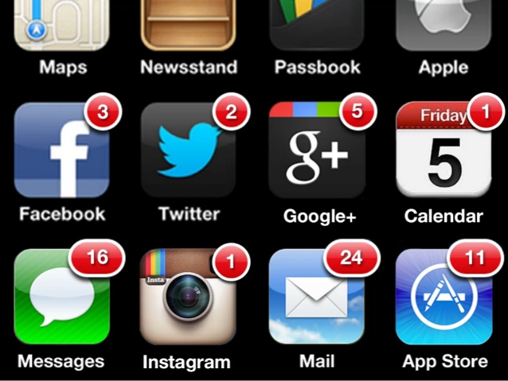
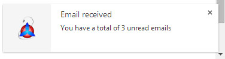

# [An Introduction to the Web Notifications API][1] (译文)

对于很多人来说(移动用户无法忍受) `56kb` 连接速度的内存的时代已经淡去。这个时候浏览器可以有足够的地方打开一个网页，甚至没有人能够预测使用多标签浏览的未来。今天，我们使用社区网络，帖子，回复，评论，照片，视频和一些更多的东西，已经不堪重负。一些系统以创建了克服需要查看每个 `tag` 来检查是否有新活动的方法。其中一个方法是 `notification`，这是在不同的网站中很普遍的。

直到不久之前，每个开发人员不得不实现自己的 `notification`，致使出现了整套不同的解决方案。`W3C` 定义了一个 `Web Notification API` 以标准的方式，解决了这个问题。

在移动设备上我们非常熟悉 `notification` 的概念。尝试离线几个小时，只要你连接到互联网，你会被安装在设备上的不同的应用程序的通知所淹没。这让人兴奋，我们的网页具有与之相同的机制，能够无缝的与 `desktop` 和移动设备一起工作。正如前言所属，该系统已被开发和标准化，所以今天我们有了 `Web Notification API`。



## What is the Web Notifications API
`Web Notification API` 被定义为 `end-user notification`(终端用户通知) 的 `API`。一个通知允许 `alert` 发生在用户当前网页的上下文之外，例如电子邮件的交付。该规范没有描述如何以及何处 UA 应该会显示这些通知。因此，我们会看到不同浏览器的不同风格，并且根据用户使用的设备，我们将看到不同位置的通知(如移动端，我们可以看到它们出现在 `notification bar`)。值得一提的是，必须得到许可，你才可以发送一个通知，浏览器才能显示一个 `alert` 给用户。



这个 `API` 已经存在一段时间，该规范已经做了一些修改。该规范已知的有两个主要版本。第一个版本在旧版本的 `Chrome` 和 `Firfox` 得以实现。现在，规范已经稳定，但截至 2014.9.4 它仍然是一个 `W3C Working Draft`。


## Methods, Properties, and Events
`Web Notification API` 使用 `window` 的 `Notification` 属性得以公开。这是一个构造函数，使我们能够创建一个 `notification` 实例。它接受两个参数 —— 一个包含 `notification` 标题的字符串，和一个用于设置的可选对象。在创建一个实例之前，让我们来看看，可以指定那些设置：

 - `body`：用于进一步指定 `notification` 目的的字符串。
 - `lang`：指定 `notification` 的 `language`，其值必须符合 `BCP47` 标准。有效字符串的例子是 `en-US` 和 `it-IT`。
 - `dir`：定义 `notification` 的文本的方向。其值可以为 `auto`，该方向是基于浏览器设置的，`ltr` 指定从左到右的方向(对于欧美语言)，或 `rtl` 指定从右向左(对于某些亚洲语言)。
 - `tag`：一个用作检索，替换或删除 `notification` 的 `ID` 的字符串。
 - `icon`：指定用作 `notification icon` 的图标的 `URL`。

要创建一个 `Notification` 对象，我们应该编写如下所示的语句：
```javascript
var notification = new Notification('Email received', {
  body: 'You have a total of 3 unread emails'
});
```
很简单，不是吗？

事实证明，我们刚刚学到的设置选项，会作为 `Notification` 实例的只读属性。此外 `Notification` 对象公开一个名为 `permission` 的属性。`permission` 包含表示当前是否有权限显示通知的字符串。其值是以下中的一个：

 - **"denied"**：这意味着用户已经拒绝通知。
 - **"granted"**：这意味着用户已发出许可。
 - **"default"**：这意味着用户是未知的。

此 `API` 公开了两个方法：`requestPermission()` 和 `close()`。根据方法名可知，前者用于请求 `permission`，以显示给用户的 `notification`，而后者则以编程的方式关闭 `notification。requestPermission()` 是 `Notification` 对象的方法，并有一个可选的 `callback` 参数，用于接收用户接受或拒绝的 `permission`。`permission` 作为参数被传递到 `callback`，并且该值可以为 `"granted"`，`"denied"`，`"default"`。
`close()` 是一个示例方法，并且不接受任何参数。

有时我们可能需要尽快执行一个 `action` 来通知状态发生变化。例如，我们想了解，用户何时点击了 `notification`，或它何时被关闭。要做到这一点，我们只需要添加 `event handler` 来处理以下事件：

 - `onclick`：当用户点击 `notification` 时触发。
 - `onclose`：当用户或浏览器关闭 `notification` 时触发。
 - `onerror`：当 `notification` 发生错误时触发。
 - `onshow`：当 `notification` 显示时触发。

一个使用这些事件基本的示例，如下：
```javascript
var notification = new Notification('Email received', {
  body: 'You have a total of 3 unread emails'
});
 
notification.onshow = function() {
  console.log('Notification shown');
};
```

## Browser Compatibility
`desktop` 和 `mobile` 设备对 Web Notification API 的支持并不太好。在 `desktop`，`Chrome` 和 `Firefox` 在不久前实现了这个 `API` 的第一个版本。但是该 `API` 的新版本，于 `Chrome 22` 和 `Firefox 22`(两者都没有浏览器前缀)实现。`Safari 6+` 也支持 `Web Notification API`。在 `mobile`，只有 `Firefox` 和 `Blackberry` 充分支持。检测浏览器是否支持该 `API` 的代码如下：
```javascript
if ('Notification' in window) {
  // API supported
} else {
  // API not supported
}
```

## Demo
在这一节，我们会向你展示一个简单的 `demo`，让你看看这个 `API` 如何使用。`demo` 有两个部分。第一个部分中，有一个表单，让你写一些文字，在 `notification` 显示时使用。第二个部分，一个按钮可以让你快速看到这个 `API` 的演示，使用预定义参数。这两个请求将触发`permission` 请求。一旦得到许可，该 `notification` 将出现 `desktop` 的屏幕上，`mobile` 的 `Notification Bar` 中。

```javasctipt
if (event.target.id === 'button-wn-show-preset') {
  // Uses the preset parameters
} else {
  // Uses the custom parameters
}
```

除了显示 `notification`，我们附加一个事件处理程序处理四个 event。该事件处理程序将发生了什么打印到 id 为 log 的元素中。

下面的代码的现场演示可以在[这里](web-notifications-api-demo.html)找到。

```javascript
<!DOCTYPE html>
<html>
  <head>
    <meta charset="UTF-8">
    <meta name="viewport" content="width=device-width, initial-scale=1.0"/>
    <title>Web Notifications API Demo</title>
    <style>
      *
      {
        -webkit-box-sizing: border-box;
        -moz-box-sizing: border-box;
        box-sizing: border-box;
      }
 
      body
      {
        max-width: 500px;
        margin: 2em auto;
        padding: 0 0.5em;
        font-size: 20px;
      }
 
      h1
      {
        text-align: center;
      }
 
      .hidden
      {
        display: none;
      }
 
      #custom-notification
      {
        margin-top: 1em;
      }
 
      label
      {
        display: block;
      }
 
      input[name="title"],
      textarea
      {
        width: 100%;
      }
 
      input[name="title"]
      {
        height: 2em;
      }
 
      textarea
      {
        height: 5em;
      }
 
      .buttons-wrapper
      {
        text-align: center;
      }
 
      .button-demo
      {
        padding: 0.5em;
        margin: 1em;
      }
 
      #log
      {
        height: 200px;
        width: 100%;
        overflow-y: scroll;
        border: 1px solid #333333;
        line-height: 1.3em;
      }
 
      .author
      {
        display: block;
        margin-top: 1em;
      }
    </style>
  </head>
  <body>
    <h1>Web Notifications API</h1>
    <span id="wn-unsupported" class="hidden">API not supported</span>
 
    <form id="custom-notification" action="">
      <label for="title">Title:</label>
      <input type="text" id="title" name="title" />
 
      <label for="body">Body:</label>
      <textarea id="body" name="body"></textarea>
 
      <div class="buttons-wrapper">
        <button id="button-wn-show-preset" class="button-demo">Show Preset Notification</button>
        <input type="submit" id="button-wn-show-custom" class="button-demo" value="Show Custom Notification" />
      </div>
    </form>
 
    <h3>Log</h3>
    <div id="log"></div>
    <button id="clear-log" class="button-demo">Clear log</button>
 
    <script>
      if (!('Notification' in window)) {
        document.getElementById('wn-unsupported').classList.remove('hidden');
        document.getElementById('button-wn-show-preset').setAttribute('disabled', 'disabled');
        document.getElementById('button-wn-show-custom').setAttribute('disabled', 'disabled');
      } else {
        var log = document.getElementById('log');
        var notificationEvents = ['onclick', 'onshow', 'onerror', 'onclose'];
 
        function notifyUser(event) {
          var title;
          var options;
 
          event.preventDefault();
 
          if (event.target.id === 'button-wn-show-preset') {
            title = 'Email received';
            options = {
              body: 'You have a total of 3 unread emails',
              tag: 'preset',
              icon: 'http://www.audero.it/favicon.ico'
            };
          } else {
            title = document.getElementById('title').value;
            options = {
              body: document.getElementById('body').value,
              tag: 'custom'
            };
          }
 
          Notification.requestPermission(function() {
            var notification = new Notification(title, options);
 
            notificationEvents.forEach(function(eventName) {
              notification[eventName] = function(event) {
                log.innerHTML = 'Event "' + event.type + '" triggered for notification "' + notification.tag + '"<br />' + log.innerHTML;
              };
            });
          });
        }
 
        document.getElementById('button-wn-show-preset').addEventListener('click', notifyUser);
        document.getElementById('button-wn-show-custom').addEventListener('click', notifyUser);
        document.getElementById('clear-log').addEventListener('click', function() {
          log.innerHTML = '';
        });
      }
    </script>
  </body>
</html>
```

## 结论
在这篇文章中，我们讨论了 `Web Notification API` 和示例。我们还介绍了它的方法、属性和事件。正如我们所看到的，使用这个 `API` 是很容易的，所以将它用在你的下一个项目中并不困难。

不幸的是，它在浏览器中并没有得到很好的支持，但由于 `Chrome`、`Firefox` 和 `Safari` 的支持，我们能够覆盖很大一部分用户。
 
  [1]: http://www.sitepoint.com/introduction-web-notifications-api/
  
 