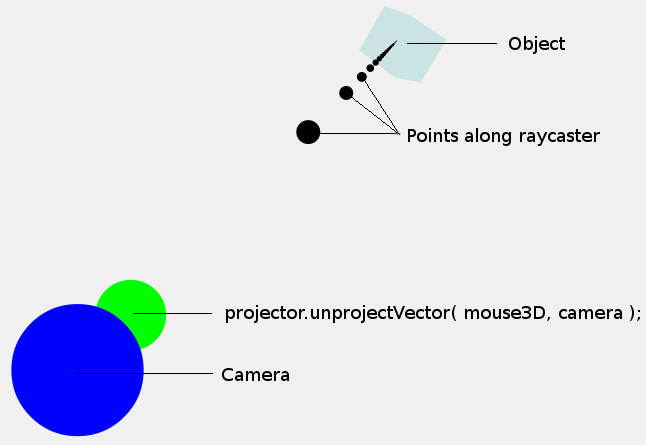

# Three.js projecting mouse clicks to a 3D scene - how to do it and how it works 
[原文][1]

## 简介

在 Three.js，这是很常见的，检测当用户点击 3D 空间中的对象。我所遇到的几个帖子和答案描述了如何做到这一点，但我发现，我需要更深入的去了解表面之下的东西。如果发生在实例代码范围之外(如画布没有填满屏幕或具有附加效果)的依然会非常棘手。在这片博客中，我们将仍然只是浅尝辄止，但我们应该对包含在该示例范围的内容充满信心。注意，在这个博客中，我们将使用 PerspectiveCamera，而不是 OrthographicCamera。

## 如何做到这一点

让我们先从一个简单的场景开始，当点击一个对象让其改变颜色。对于鼠标按下的事件的代码会是这样的：
```javascript
 function onDocumentMouseDown( event ) {
	 var mouse3D = new THREE.Vector3( ( event.clientX / window.innerWidth ) * 2 - 1, //x
									 -( event.clientY / window.innerHeight ) * 2 + 1, //y
										0.5 ); //z
	projector.unprojectVector( mouse3D, camera );
	mouse3D.sub( camera.position );
	mouse3D.normalize();
	var raycaster = new THREE.Raycaster( camera.position, mouse3D );
	var intersects = raycaster.intersectObjects( objects );
	// Change color if hit block
	if ( intersects.length > 0 ) {
		intersects[ 0 ].object.material.color.setHex( Math.random() * 0xffffff );
	}
}
```
随着最近发布 three.js(约 r55 及更高版本)，你可以使用 pickingRay 从而进行简化，甚至可以让上面的函数像这样：
```javascript
var mouse3D = new THREE.Vector3(( event.clientX / window.innerWidth ) * 2 - 1,   //x
        -( event.clientY / window.innerHeight ) * 2 + 1,  //y
        0.5);                                            //z
var raycaster = projector.pickingRay(mouse3D.clone(), camera);
var intersects = raycaster.intersectObjects(objects);
// Change color if hit block
if (intersects.length > 0) {
    intersects[0].object.material.color.setHex(Math.random() * 0xffffff);
}
```
在这篇博客中，我们将坚持使用旧的方法，因为它使我们更深入的了解在底层是发生的事情。你可以在[这里](projspikesfssimple.html)查看该示例，只需点击立方体就可以改变其颜色。

## 它是如何工作的

现在，让我们来一步一步看看所发生的事情：
```javascript
var mouse3D = new THREE.Vector3(( event.clientX / window.innerWidth ) * 2 - 1,   //x
        -( event.clientY / window.innerHeight ) * 2 + 1,  //y
        0.5);
```
我已经看到了一些博客描述了这一步骤，我们实际上可以很容易的理解这一步。`vent.clientX` 是点击位置的 `x` 坐标。通过`window.innerWidth` 划分出的点击在全窗口宽度的比例位置。下表显示了相应的结果的鼠标点击的位置：

| event.clientX         | event.clientX / window.innerWidth*2-1 |
| --------------------- | ------------------------------------: | 
| 0                     | -1                                    |
| window.innerWidth/2   | 0                                     |
| window.innerWidth     | 1                                     |


| event.clientY         | event.clientY / window.innerHeight*2-1 |
| --------------------- | ------------------------------------: | 
| 0                     | 1                                     |
| window.innerHeight/2  | 0                                     |
| window.innerHeight    | -1                                    |

基本上，它是将屏幕坐标系从左上角的 (0,0) 到 右下角的(window.innerWidth, window.innerHeight)，平移到了中心为 (0,0) 并从 (-1,1) 到 (1,1) 的直角坐标，如下图所示：


注意，`z` 的值为 0.5。我不会我考虑 `z` 值，在这里只能说预计该点的深度远离 z 轴 3D 空间中的 camera。在最后会进行讨论。

好了，我们现在明白了，鼠标点击在右侧图像所在的位置(·mouse3D· 包含此位置)。下一个：
```javascript
	projector.unprojectVector( mouse3D, camera );
```

在这里神奇的事情发生了。如果你看一下 three.js 代码，你会看到，camera 通过施加在它上的 vector  projection(投影)到 3D 世界。我理解为如下的方式：
 - 忘记从 2D 投影到 3D，让我们逆向思考 - 3D 世界是如何 projected(投射) 到 2D 屏幕的。为了从 3D 世界坐标系中得到 2D 屏幕上的投影，3D 世界需要被投射到 camera 的 2D 平面(这是在你屏幕上看到的)。
 - 因此，要从屏幕上的 2D 坐标到 3D 空间，需要做的事情相反。
 - 首先 camera 屏幕在 2D 坐标系中以 0,0 为中心。位置 mouse3D 在这个空间将给你该表面上的位置。现在，可能不是在该中心 (0,0)，因此还有一些额外的变换转换到实际位置。这意味着，你可以任意移动 camera，让它看起来在三维空间中的不同点和投影仍然有效。这很棒。

上面所述要点的这些工作方式超出了这篇博客的范围，但我希望他们能让你察觉到幕后发生了什么。请注意，现在 mouse3D 将包含这个 unprojected value。3D 空间中的点是沿着 ray/trajectory(射线/轨迹) 的位置。确切点取决于 Z 值(我们看这个版本)。

在这一点上，看看下面的图像可以帮助你理解：



我们刚刚计算出的这个点(mouse3D)显示为绿线。注意该点的尺寸只是为了起到说明作用，它与 camera 或 mouse3D 点的大小无关。还需要注意沿射线显示出来的点只是任意的一些点，光线是从 camera 而不是一组点的方向射出。

现在，我们不只是要在 3D 空间中的一个点，而是希望有一个 ray/trajectory(由黑点所示)，这样我们就可以判断一个对象是否沿着此 ray/trajectory。幸运的是，因为我们有一个单一的点，我们知道，轨迹必须通过从 camera 到这一点，我们就可以判断光线的方向。因此，下一步就是将 mouse3D position 减去 camera position，这将提供一个方向矢量，而不是只是一个单一的点：

```javascript
	mouse3D.sub( camera.position );
    mouse3D.normalize();
```

现在，我们又从 camera 到这个点的 3D 空间中的方向(现在 `mouse3D` 包含此方向)。这随后通过 normalizing 就变成一个单位矢量。你可以在网上阅读有关 unit vector(e.g. [Wikipedia](http://en.wikipedia.org/wiki/Unit_vector))。下一步是创建一个射线（Raycaster）开始于 camera position和使用方向（mouse3D）的投射线。

```javascript
	var raycaster = new THREE.Raycaster( camera.position, mouse3D );
```

代码的其余部分确定在 3D 空间中对象是否与射线相交。这可以通过确定每个对象是否在 ray 所述的 x,y和z 的范围内进行测定。幸运的是可以通过 `intersectsObjects` 来完成。

## Demo

好了，让我们来看看这个 [demo](demo.html),显示了被投影到 3D 空间中的这些射线。当你点击任何地方，camera 绕对象想你展示射线是如何投射的。请注意，当相机放回到原来的位置，你只能看到一个点。这是因为所有其他点都沿着该投影线，因此，从视图阻断前面的点。这是类似的，当你往下看一个箭头远离你的线 - 你所看到的只有基点。当然，这同样适用于低头直接看一个箭头指向你的线.

您看到的画线由我的方法 drawRayLine（rayCaster）绘制沿射线的点。

## The z coordinate 
按照承诺，让我们再看看这个 z 坐标。请参阅本 [demo](projspikesfs.html) 为你完成此部分阅读和尝试使用不同的 z。

ok，让我们再看看这个函数：
```javascript
var mouse3D = new THREE.Vector3(( event.clientX / window.innerWidth ) * 2 - 1,   //x
        -( event.clientY / window.innerHeight ) * 2 + 1,  //y
        0.5);
```

我们选择 0.5 作为值。前面我提到 z 左边控制投射到 3D 的深度。所以，让我们来看看 z 值得不同，会有什么样的影响。要做到这一点，我已经放置了一个蓝点的标志摄像机在哪里，以及一个多个点的绿线标志从 camera 到 unprojected 的位置。接着，对交叉点进行了计算后，我们移动 camera 背面和侧面显示这个 ray。最好的几个例子：

首先，z 值为 0.5：


注意由点组成的绿线是从 camera(蓝点)到 unprojected(在 3D 空间中的坐标)。这就像枪杆子，ray 指向它指向的方向。绿线实质上代表标准化之前计算出的方向。

OK，让我们尝试一下 0.9 的值：


正如你所看到的，绿线现在已进一步延伸到 3D 空间。0.99进一步延伸：
我不知道大的 z 值是否有任何的重要性。似乎，更大的值将更加精确(如较长的枪管)，但因为我们运算的方向，即使很短的距离应该也是相当准确的。我所看到的示例都是用 0.5，所以这就是我特别指出的。

## 投影时，画布是不是全屏
现在，我们知道了它是如何工作的，我们可以找出在画布没有填充窗口是的值，并且在页面上定位。例如：
 - 包含在 div 中的 three.js canvas 的 offsetX 和 offsetY。
 -  canvas 宽度等于 viewWidth 和 高度等于 viewHeight。

对于，全屏我们有：
```javascript
var mouse3D = new THREE.Vector3( ( event.clientX / window.innerWidth ) * 2 - 1,   //x
                                        -( event.clientY / window.innerHeight ) * 2 + 1,  //y
                                        0.5 );`
```

现在，这将成为：
```javascript
var mouse3D = new THREE.Vector3( ( event.clientX - offsetX ) / viewWidth * 2 - 1,
                                        -( event.clientY - offsetY ) / viewHeight * 2 + 1,
                                        0.5 );
```

基本上，我们正在做的是运算相对于鼠标点击画布的位置(x: `event.clientX - offsetX`)。然后，我们确定该比例发生点击的位置(x: `/ viewWidth`)类似，当画布填充窗口。

## Done

这就是它。我们不得不看看到底是怎么回事，利用 Three.js 当鼠标点击选择 3D 空间的物体。我认为可以更深入的看看 `projector.unprojectVector()` 是如何做到的，特别是看看 camera projection matrix 如何工作。


  [1]: http://barkofthebyte.azurewebsites.net/post/2014/05/05/three-js-projecting-mouse-clicks-to-a-3d-scene-how-to-do-it-and-how-it-works/